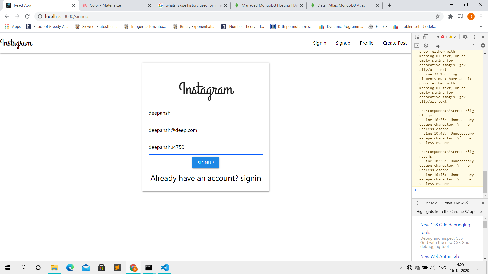
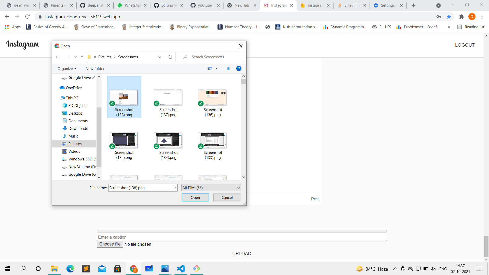
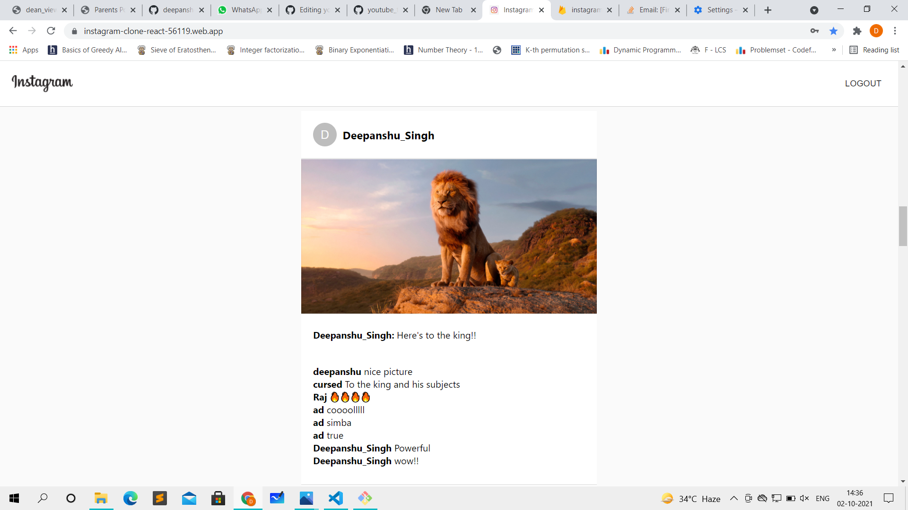

# Instagram Clone

A clone of instagram with implemented functionalities of uploading posts, comment , authentication.

Technology used 


#### Clone the project

```bash
  git clone https://github.com/deepanshusingh-hub/instagram-clone-react/
```
#### Running server
````
$ cd my-project
$ npm start

````



